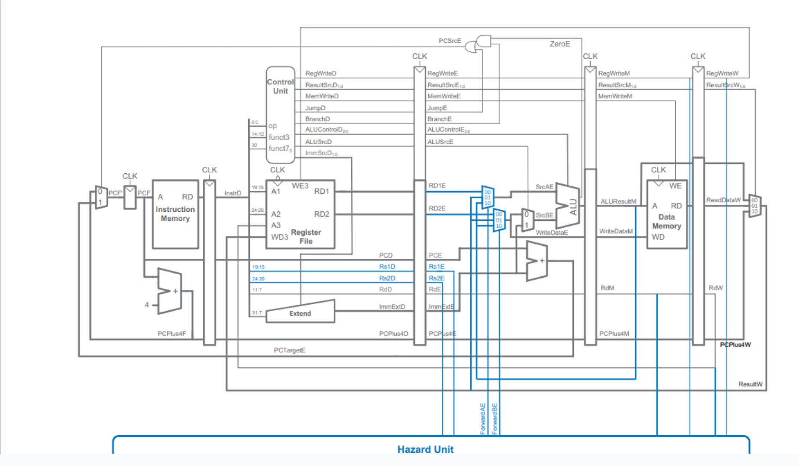

# RISC-V 5-Stage Pipelined Processor



## Overview
This repository contains the RTL implementation of a 32-bit RISC-V (RV32I) processor using a classic 5-stage pipelined architecture. The design serves as Phase I of a larger Capstone project titled "Heterogeneous Out-of-Order RISC-V SoC: Architecting Dynamic Scheduling & Hardware Acceleration."

The core is designed in Verilog HDL and verified using Xilinx Vivado. It features a dedicated hazard handling unit to resolve data dependencies via forwarding and control hazards via flushing, ensuring high instruction throughput.

## Project Team
* Vikram Singh (241EC164)
* Rushil Jain (241EC148)
* Sonigara Jainam (241EC155)
* Somyak Mohanta

## Key Features
* ISA Compliance: RISC-V RV32I Base Integer Instruction Set (supports ~35 instructions).
* Pipeline Depth: 5-Stage (Fetch, Decode, Execute, Memory, Writeback).
* Hazard Management:
    * Data Hazards: Resolved using an Operand Forwarding Unit (resolves RAW hazards without stalling).
    * Control Hazards: Handled via flushing with a static "Assume Not Taken" prediction strategy.
* Memory Architecture: Harvard Architecture (Separate Instruction and Data Memory).
* Verification: Behavioral simulation validated with hex-file memory initialization.

## Project Structure

```text
├── pp.xpr                          # Xilinx Vivado Project File
├── pp.srcs/
│   ├── sources_1/new/              # RTL Source Codes
│   │   ├── top_module.v            # Top-level processor module
│   │   ├── hazard_unit.v           # Hazard detection and forwarding logic
│   │   ├── controlpath.v           # Main control unit
│   │   ├── alu.v                   # Arithmetic Logic Unit
│   │   ├── pp_stage_2.v to 5.v     # Pipeline stage registers
│   │   ├── reg_file_.v             # Register File (32 x 32-bit)
│   │   ├── data_mem.v              # Data Memory
│   │   └── instruction.v           # Instruction Memory
│   └── sim_1/new/                  # Simulation Files
│       └── testbench.v             # Main Testbench
├── hex_files/                      # Memory Initialization Files
│   ├── rv32i_real.hex              # Instruction Memory Hex Code
│   ├── data_mem_file.hex           # Initial Data Memory Values
│   └── register_file_counting.hex  
└── architecture.png                # High-level Architecture Design
```


## Getting Started

### Prerequisites
* Xilinx Vivado (Version 2024.2 or compatible recommended)
* Git

### Simulation Steps
1.  Clone the Repository:
    git clone https://github.com/sp0663/gesture_media_controller.git

2.  Open Project:
    Launch Vivado and open the pp.xpr file found in the root directory.

3.  Load Memory Initialization:
    Ensure the .hex files in the simulation sources point to the correct file paths on your local machine. You may need to edit $readmemh paths in instruction.v and data_mem.v.

4.  Run Simulation:
    Execute a Behavioral Simulation in Vivado to observe the instruction pipeline, register updates, and PC increments.

## Simulation Results

The following waveform demonstrates the processor executing a sequence of RV32I instructions. The signals highlight the correct propagation of the Program Counter (PC), ALU results, and Writeback stages.


## Roadmap & Future Prospects
This repository represents the completed Phase I of the Capstone project. The development timeline is structured as follows:

* Phase I (Completed): Design and verification of the 5-Stage Pipelined Core with a functional Hazard Unit.
* Phase II (Current Focus): Implementation of Dynamic Scheduling (Tomasulo's Algorithm) and advanced Branch Prediction.
* Phase III: Heterogeneous System Integration, including Direct Memory Access (DMA) and a SIMT-based GPU subsystem.
* Phase IV: Full System Integration, RTL-to-GDSII flow (Tape-out preparation), and custom OS bootloader development.

## Acknowledgements & Resources
This project utilizes knowledge and resources from the following:
* Onur Mutlu Lectures (ETH Zurich): Computer Architecture and Digital Design.
* Nick's GPU Architecture Series: Fundamentals of GPU design.
* Tiny GPU (Adam Maj): Reference for GPU RTL design patterns.
* NPTEL: Lectures on Multicore Computer Architecture.

## License
This project is licensed under the NITK License.
